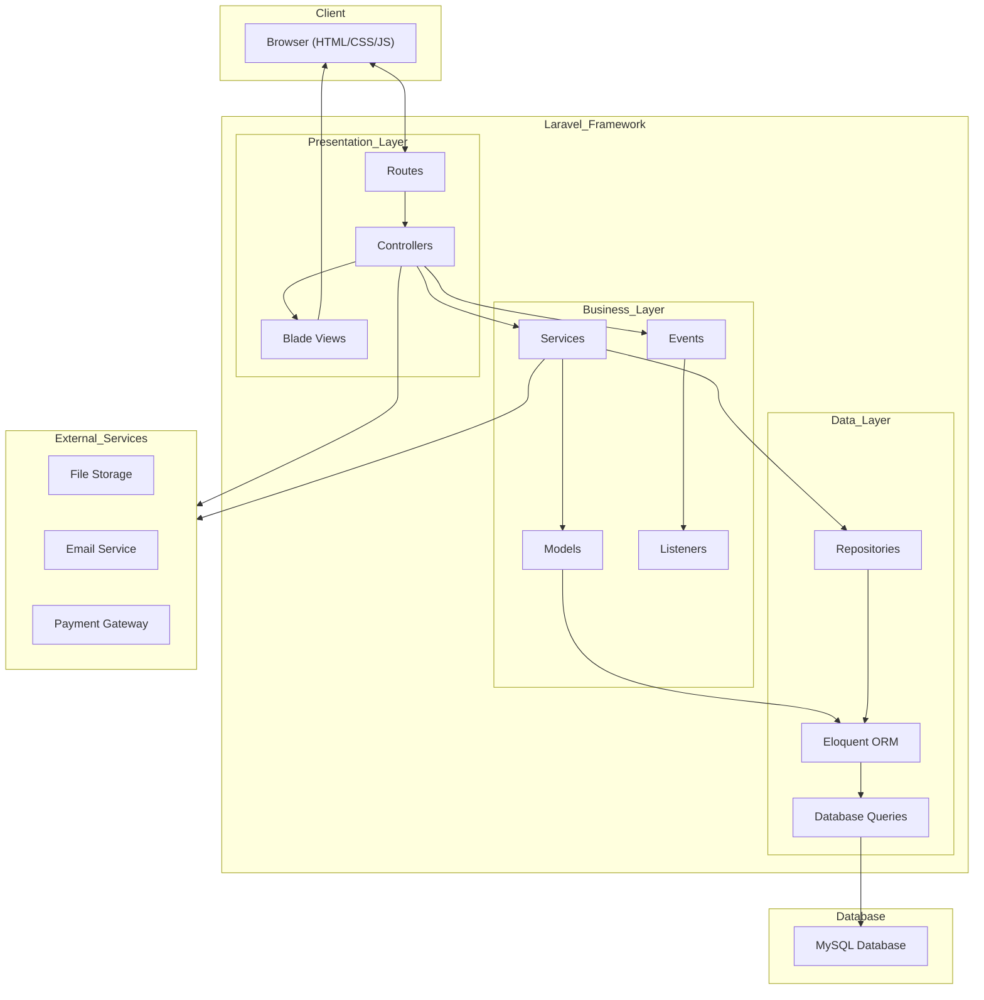
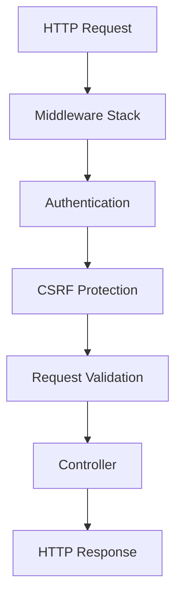

# Architectuur Diagram - Lerox Motoren

## MVC Architectuur

## Architectuur Componenten

### Presentation Layer
- **Routes**: Definieert URL-routes en verbindt ze met controller-acties
- **Controllers**: Verwerkt HTTP-verzoeken, roept services aan en geeft antwoorden terug
- **Blade Views**: Sjablonen voor het genereren van HTML-weergaven

### Business Layer
- **Services**: Bevat bedrijfslogica en coördineert tussen controllers en data layer
- **Models**: Representeert domeinentiteiten en hun relaties
- **Events & Listeners**: Implementeert event-driven architectuur voor losgekoppelde functionaliteit

### Data Layer
- **Repositories**: Abstraheert data-toegang en -manipulatie
- **Eloquent ORM**: Object-Relational Mapping voor database-interacties
- **Database Queries**: Raw SQL en query builder voor complexe queries

### External Services
- **File Storage**: Voor het opslaan van afbeeldingen en documenten
- **Email Service**: Voor het verzenden van e-mails naar klanten
- **Payment Gateway**: Voor het verwerken van betalingen

## Dataflow

1. De browser stuurt een HTTP-verzoek naar de applicatie
2. Routes leiden het verzoek naar de juiste controller-actie
3. De controller roept services aan om bedrijfslogica uit te voeren
4. Services gebruiken repositories en models om data te manipuleren
5. Eloquent ORM vertaalt model-operaties naar database-queries
6. De controller geeft een response terug, meestal via een Blade view
7. De browser ontvangt en toont de HTML-response

## Beveiligingslagen

1. **Middleware Stack**: Verwerkt het verzoek vóór het de controller bereikt
2. **Authentication**: Controleert gebruikersidentiteit en autorisatie
3. **CSRF Protection**: Voorkomt Cross-Site Request Forgery aanvallen
4. **Request Validation**: Valideert invoergegevens volgens gedefinieerde regels
5. **Controller**: Verwerkt het gevalideerde verzoek
6. **Response**: Genereert een HTTP-antwoord
