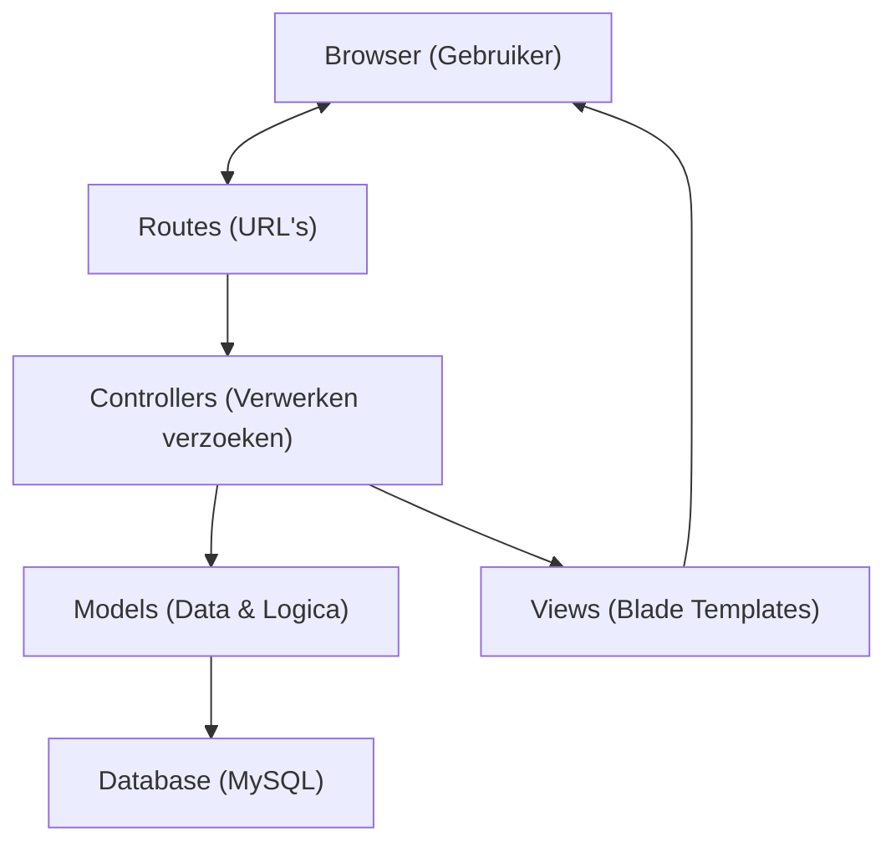
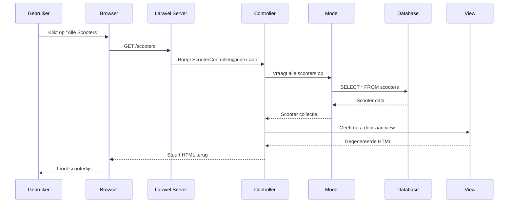

# Architectuur Diagram - Lerox Motoren

## MVC Architectuur Uitleg

De Lerox Motoren applicatie gebruikt het MVC (Model-View-Controller) patroon, wat een standaard is in Laravel. Hieronder zie je een vereenvoudigd diagram van hoe dit werkt:



## Wat doet elk onderdeel?

### 1. Browser
Dit is waar de gebruiker de website bezoekt. De browser stuurt verzoeken naar de server en toont de resultaten.

### 2. Routes
Routes bepalen welke URL naar welke controller-actie gaat. Bijvoorbeeld:
- `/scooters` → ScooterController@index
- `/scooters/1` → ScooterController@show

### 3. Controllers
Controllers ontvangen verzoeken, werken met models om data op te halen of te wijzigen, en geven views terug. Ze zijn als verkeersregelaars die bepalen wat er moet gebeuren.

### 4. Models
Models vertegenwoordigen de data en bedrijfslogica. Ze werken direct met de database en bevatten regels over hoe data moet worden opgeslagen en opgehaald.

### 5. Views
Views zijn de templates die HTML genereren. Ze tonen de data aan de gebruiker op een mooie manier.

### 6. Database
Hier wordt alle data opgeslagen (gebruikers, scooters, onderdelen, etc.).

## Hoe werkt een typisch verzoek?



## Speciale Laravel Features

### Middleware
Middleware werkt als een filter tussen de browser en je controllers. Het kan verzoeken controleren en eventueel blokkeren. Bijvoorbeeld:
- Controleren of een gebruiker is ingelogd
- Beschermen tegen CSRF-aanvallen (Cross-Site Request Forgery)

### Eloquent ORM
Eloquent maakt het werken met de database eenvoudiger. In plaats van SQL te schrijven, gebruik je PHP-objecten:

```php
// In plaats van: SELECT * FROM scooters WHERE brand = 'Lerox'
$scooters = Scooter::where('brand', 'Lerox')->get();
```

### Blade Templates
Blade is het template systeem van Laravel. Het maakt het eenvoudig om dynamische inhoud in HTML te tonen:

```php
<!-- Toon alle scooters -->
@foreach($scooters as $scooter)
    <div>{{ $scooter->name }} - € {{ $scooter->price }}</div>
@endforeach
```
