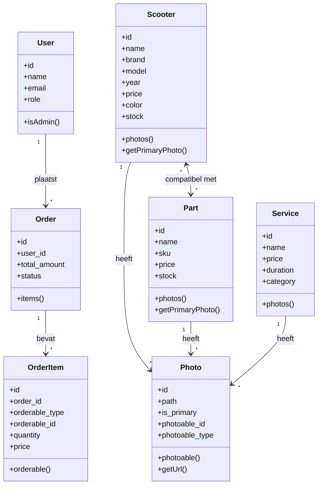

# Klassendiagram - Lerox Motoren

## Uitleg van de klassen

### User
De gebruiker van het systeem, kan een klant of admin zijn.
- **Belangrijke methoden**: `isAdmin()` controleert of een gebruiker beheerrechten heeft

### Scooter
Representeert een scooter in de webshop.
- **Belangrijke methoden**: `photos()` geeft alle foto's van de scooter, `getPrimaryPhoto()` geeft de hoofdfoto

### Part
Representeert een onderdeel dat verkocht wordt of compatibel is met scooters.
- **Belangrijke methoden**: `photos()` geeft alle foto's van het onderdeel

### Service
Representeert een dienst die aangeboden wordt in de webshop.
- **Belangrijke methoden**: `photos()` geeft alle foto's van de dienst

### Photo
Representeert een afbeelding die gekoppeld is aan een scooter, onderdeel of dienst.
- **Belangrijke methoden**: `photoable()` geeft het object waar de foto bij hoort, `getUrl()` geeft de URL van de afbeelding

## Wat is een polymorfische relatie?

In dit project worden polymorfische relaties gebruikt voor foto's en bestelitems. Dit betekent dat:

1. **Eén foto-klasse** kan gebruikt worden voor verschillende soorten producten (scooters, onderdelen, diensten)
2. **Eén bestelitem-klasse** kan verwijzen naar verschillende soorten producten

Dit werkt via twee speciale velden:
- `photoable_id`: Het ID van het product
- `photoable_type`: Het type product (bijv. "App\Models\Scooter")

### Voordelen
- Minder code herhaling
- Flexibeler systeem
- Eenvoudiger onderhoud
