# Controller Diagram - Lerox Motoren

```mermaid
classDiagram
    class Controller {
        <<Abstract>>
    }
    
    class HomeController {
        +index()
        +about()
        +contact()
    }
    
    class ScooterController {
        +index()
        +show(id)
        +create()
        +store(Request)
        +edit(id)
        +update(id, Request)
        +destroy(id)
    }
    
    class PartController {
        +index()
        +show(id)
        +create()
        +store(Request)
        +edit(id)
        +update(id, Request)
        +destroy(id)
    }
    
    class ServiceController {
        +index()
        +show(id)
        +create()
        +store(Request)
        +edit(id)
        +update(id, Request)
        +destroy(id)
    }
    
    class PhotoController {
        +store(Request, id)
        +setPrimary(id)
        +destroy(id)
    }
    
    class OrderController {
        +index()
        +show(id)
        +create()
        +store(Request)
        +edit(id)
        +update(id, Request)
        +destroy(id)
        +checkout()
        +complete()
    }
    
    class QuoteRequestController {
        +index()
        +show(id)
        +create()
        +store(Request)
        +markAsProcessed(id)
        +destroy(id)
    }
    
    class LanguageController {
        +switchLang(lang)
        +updateEnv(key, value)
    }
    
    class Auth.LoginController {
        +showLoginForm()
        +login(Request)
        +logout()
    }
    
    class Auth.RegisterController {
        +showRegistrationForm()
        +register(Request)
    }
    
    Controller <|-- HomeController
    Controller <|-- ScooterController
    Controller <|-- PartController
    Controller <|-- ServiceController
    Controller <|-- PhotoController
    Controller <|-- OrderController
    Controller <|-- QuoteRequestController
    Controller <|-- LanguageController
    Controller <|-- Auth.LoginController
    Controller <|-- Auth.RegisterController
```

## Controller Verantwoordelijkheden

### HomeController
Verantwoordelijk voor het tonen van de hoofdpagina's van de website, zoals de homepage, over ons pagina en contactpagina.

### ScooterController
Beheert alle CRUD-operaties voor scooters, inclusief het tonen van lijsten, details en formulieren voor het aanmaken en bewerken van scooters.

### PartController
Beheert alle CRUD-operaties voor onderdelen, inclusief het tonen van lijsten, details en formulieren voor het aanmaken en bewerken van onderdelen.

### ServiceController
Beheert alle CRUD-operaties voor diensten, inclusief het tonen van lijsten, details en formulieren voor het aanmaken en bewerken van diensten.

### PhotoController
Beheert het uploaden, verwijderen en instellen van primaire foto's voor verschillende entiteiten (scooters, onderdelen, diensten) via polymorfische relaties.

### OrderController
Beheert het bestelproces, inclusief het tonen van bestellingen, afrekenen en het voltooien van bestellingen.

### QuoteRequestController
Beheert offerteaanvragen, inclusief het tonen van lijsten, details en het markeren van aanvragen als verwerkt.

### LanguageController
Beheert de taalwisseling in de applicatie, inclusief het bijwerken van de taalinstelling in de sessie en het .env bestand.

### Auth Controllers
Beheren authenticatie en registratie van gebruikers, inclusief inloggen, uitloggen en registreren van nieuwe gebruikers.
