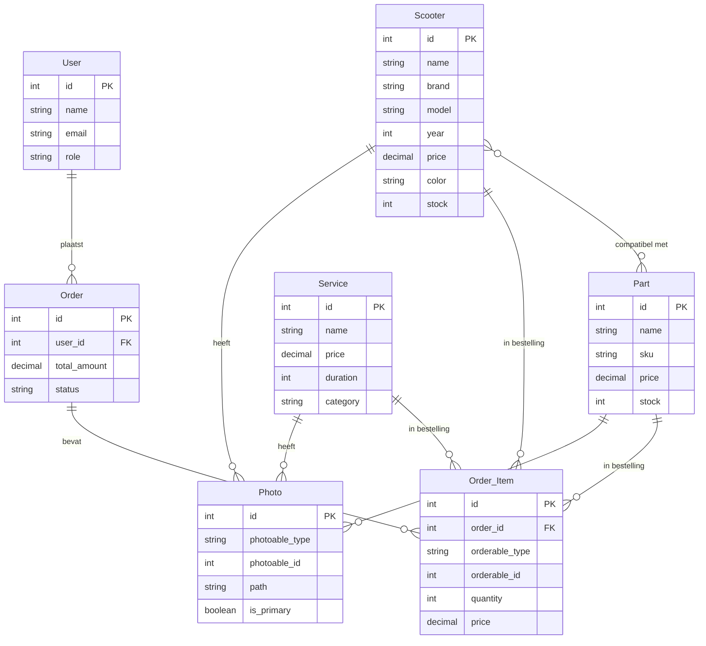

# Entity Relationship Diagram (ERD)

Dit diagram toont de belangrijkste entiteiten in de database en hun relaties.

## Uitleg van de relaties

- **User - Order**: Een gebruiker kan meerdere bestellingen plaatsen
- **Scooter - Photo**: Een scooter kan meerdere foto's hebben
- **Part - Photo**: Een onderdeel kan meerdere foto's hebben
- **Service - Photo**: Een dienst kan meerdere foto's hebben
- **Scooter - Part**: Scooters en onderdelen hebben een veel-op-veel relatie (compatibiliteit)
- **Order - Order_Item**: Een bestelling bevat meerdere bestelitems
- **Order_Item - (Scooter/Part/Service)**: Een bestelitem kan verwijzen naar een scooter, onderdeel of dienst

## Polymorfische relaties

- **Photo**: Heeft een polymorfische relatie met Scooter, Part en Service via `photoable_type` en `photoable_id`
- **Order_Item**: Heeft een polymorfische relatie met Scooter, Part en Service via `orderable_type` en `orderable_id`
