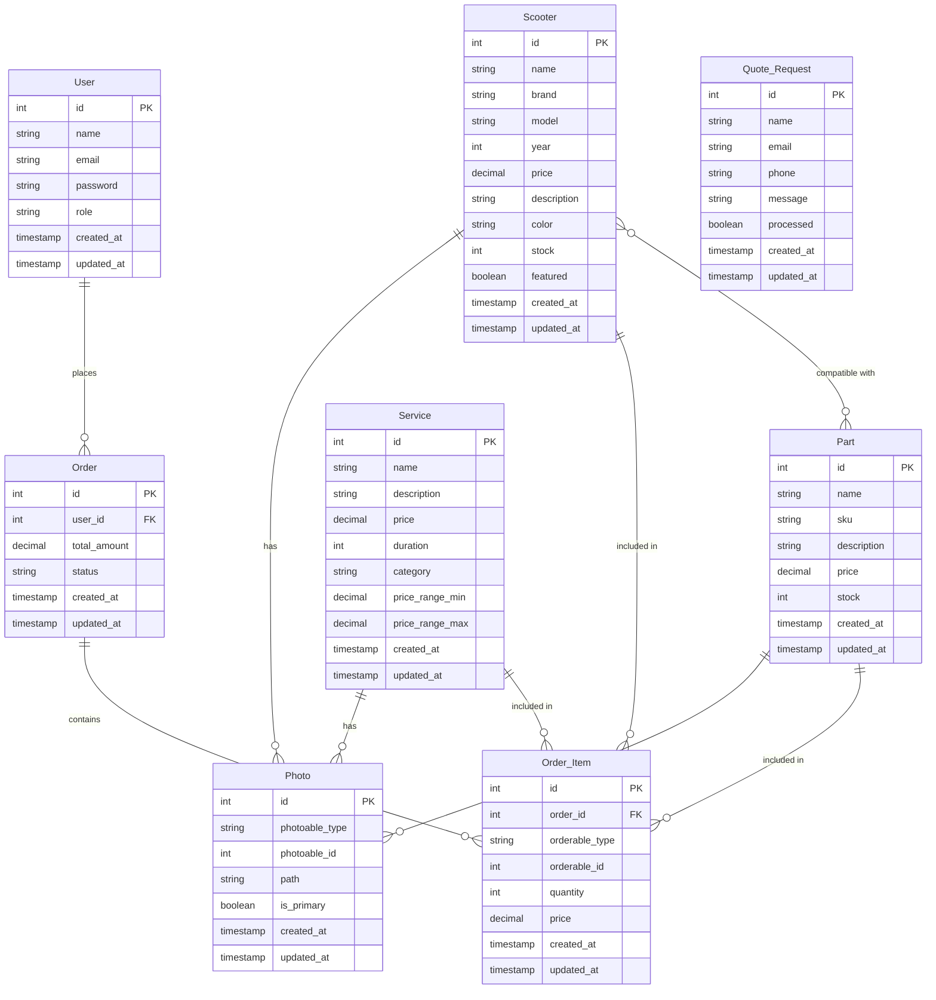

```mermaid
erDiagram
    User ||--o{ Order : "places"
    User {
        int id PK
        string name
        string email
        string password
        string role
        timestamp created_at
        timestamp updated_at
    }
    
    Scooter ||--o{ Photo : "has"
    Scooter ||--o{ Order_Item : "included in"
    Scooter }o--o{ Part : "compatible with"
    Scooter {
        int id PK
        string name
        string brand
        string model
        int year
        decimal price
        string description
        string color
        int stock
        boolean featured
        timestamp created_at
        timestamp updated_at
    }
    
    Part ||--o{ Photo : "has"
    Part ||--o{ Order_Item : "included in"
    Part {
        int id PK
        string name
        string sku
        string description
        decimal price
        int stock
        timestamp created_at
        timestamp updated_at
    }
    
    Service ||--o{ Photo : "has"
    Service ||--o{ Order_Item : "included in"
    Service {
        int id PK
        string name
        string description
        decimal price
        int duration
        string category
        decimal price_range_min
        decimal price_range_max
        timestamp created_at
        timestamp updated_at
    }
    
    Order ||--o{ Order_Item : "contains"
    Order {
        int id PK
        int user_id FK
        decimal total_amount
        string status
        timestamp created_at
        timestamp updated_at
    }
    
    Order_Item {
        int id PK
        int order_id FK
        string orderable_type
        int orderable_id
        int quantity
        decimal price
        timestamp created_at
        timestamp updated_at
    }
    
    Photo {
        int id PK
        string photoable_type
        int photoable_id
        string path
        boolean is_primary
        timestamp created_at
        timestamp updated_at
    }
    
    Quote_Request {
        int id PK
        string name
        string email
        string phone
        string message
        boolean processed
        timestamp created_at
        timestamp updated_at
    }
```
