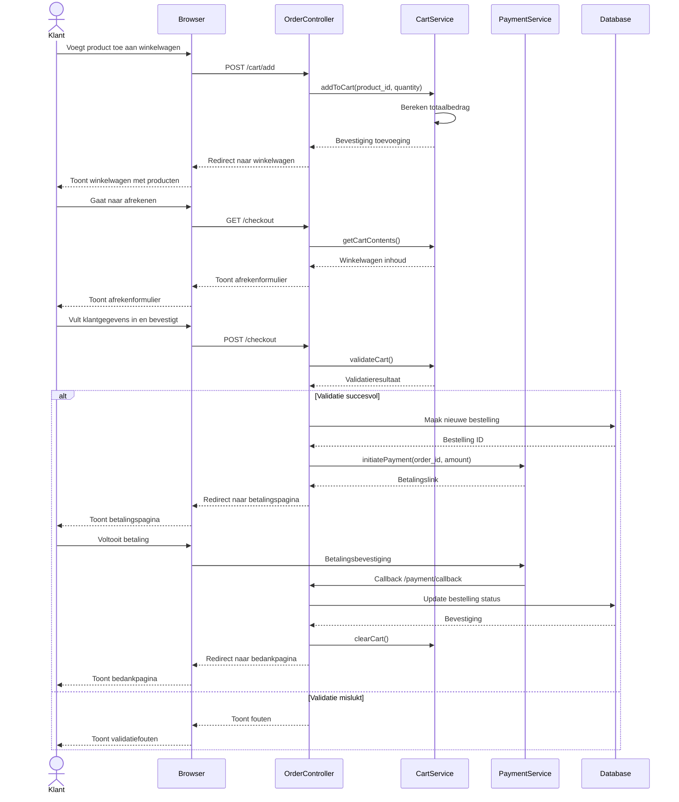

# Sequence Diagram - Bestelproces

## Proces Beschrijving

Dit sequence diagram beschrijft het volledige bestelproces in de Lerox Motoren applicatie, van het toevoegen van producten aan de winkelwagen tot het voltooien van de bestelling.

## Actoren en Componenten

- **Klant**: De gebruiker die een bestelling plaatst
- **Browser**: De webbrowser van de gebruiker
- **OrderController**: De controller die het bestelproces afhandelt
- **CartService**: De service die de winkelwagen beheert
- **PaymentService**: De service die betalingen verwerkt
- **Database**: De database waar bestellingen worden opgeslagen

## Sequence Diagram

## Toelichting

1. **Toevoegen aan winkelwagen**:
   - De klant voegt een product toe aan de winkelwagen
   - De CartService berekent het totaalbedrag
   - De klant wordt doorgestuurd naar de winkelwagenpagina

2. **Afrekenen**:
   - De klant gaat naar de afrekenpage
   - De OrderController haalt de inhoud van de winkelwagen op
   - De klant vult klantgegevens in en bevestigt de bestelling

3. **Verwerking en betaling**:
   - De bestelling wordt gevalideerd
   - Bij succesvolle validatie wordt een nieuwe bestelling aangemaakt
   - De betaling wordt geïnitieerd via de PaymentService
   - De klant wordt doorgestuurd naar de betalingspagina

4. **Afronding**:
   - Na succesvolle betaling wordt de bestelling bijgewerkt
   - De winkelwagen wordt leeggemaakt
   - De klant wordt doorgestuurd naar een bedankpagina

5. **Foutafhandeling**:
   - Bij validatiefouten wordt de klant teruggestuurd naar het afrekenformulier
   - Foutmeldingen worden getoond
