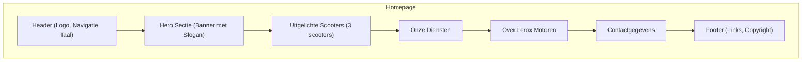
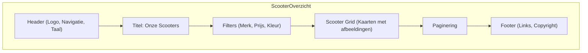
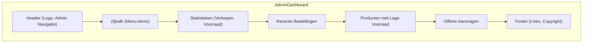
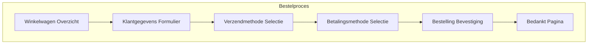

# Wireframes Lerox Motoren

## Homepage Wireframe

```mermaid
graph TD
    subgraph Homepage
        Header["Header (Logo, Navigatie, Taal)"]
        Hero["Hero Sectie (Banner met Slogan)"]
        FeaturedScooters["Uitgelichte Scooters (3 scooters)"]
        ServicesSection["Onze Diensten"]
        AboutSection["Over Lerox Motoren"]
        ContactSection["Contactgegevens"]
        Footer["Footer (Links, Copyright)"]
        
        Header --> Hero
        Hero --> FeaturedScooters
        FeaturedScooters --> ServicesSection
        ServicesSection --> AboutSection
        AboutSection --> ContactSection
        ContactSection --> Footer
    end
```

## Scooter Overzicht Wireframe

```mermaid
graph TD
    subgraph ScooterOverzicht
        Header["Header (Logo, Navigatie, Taal)"]
        Title["Titel: Onze Scooters"]
        Filters["Filters (Merk, Prijs, Kleur)"]
        ScooterGrid["Scooter Grid (Kaarten met afbeeldingen)"]
        Pagination["Paginering"]
        Footer["Footer (Links, Copyright)"]
        
        Header --> Title
        Title --> Filters
        Filters --> ScooterGrid
        ScooterGrid --> Pagination
        Pagination --> Footer
    end
```

## Scooter Detail Wireframe

```mermaid
graph TD
    subgraph ScooterDetail
        Header["Header (Logo, Navigatie, Taal)"]
        BreadCrumb["Breadcrumb Navigatie"]
        ImageGallery["Afbeeldingengalerij"]
        ScooterInfo["Scooter Informatie (Naam, Merk, Prijs)"]
        Description["Beschrijving"]
        Specs["Specificaties (Tabel)"]
        CompatibleParts["Compatibele Onderdelen"]
        CallToAction["Bestel/Offerte Knoppen"]
        Footer["Footer (Links, Copyright)"]
        
        Header --> BreadCrumb
        BreadCrumb --> ImageGallery
        ImageGallery --> ScooterInfo
        ScooterInfo --> Description
        Description --> Specs
        Specs --> CompatibleParts
        CompatibleParts --> CallToAction
        CallToAction --> Footer
    end
```

## Admin Dashboard Wireframe

```mermaid
graph TD
    subgraph AdminDashboard
        Header["Header (Logo, Admin Navigatie)"]
        Sidebar["Zijbalk (Menu-items)"]
        Stats["Statistieken (Verkopen, Voorraad)"]
        RecentOrders["Recente Bestellingen"]
        LowStock["Producten met Lage Voorraad"]
        QuoteRequests["Offerte Aanvragen"]
        Footer["Footer (Links, Copyright)"]
        
        Header --> Sidebar
        Sidebar --> Stats
        Stats --> RecentOrders
        RecentOrders --> LowStock
        LowStock --> QuoteRequests
        QuoteRequests --> Footer
    end
```

## Bestelproces Wireframe

```mermaid
graph TD
    subgraph Bestelproces
        Cart["Winkelwagen Overzicht"]
        UserInfo["Klantgegevens Formulier"]
        Shipping["Verzendmethode Selectie"]
        Payment["Betalingsmethode Selectie"]
        Confirmation["Bestelling Bevestiging"]
        ThankYou["Bedankt Pagina"]
        
        Cart --> UserInfo
        UserInfo --> Shipping
        Shipping --> Payment
        Payment --> Confirmation
        Confirmation --> ThankYou
    end
```
